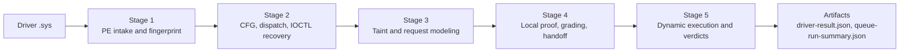
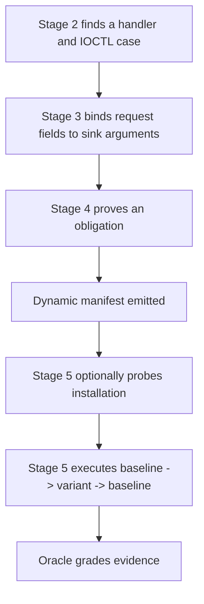
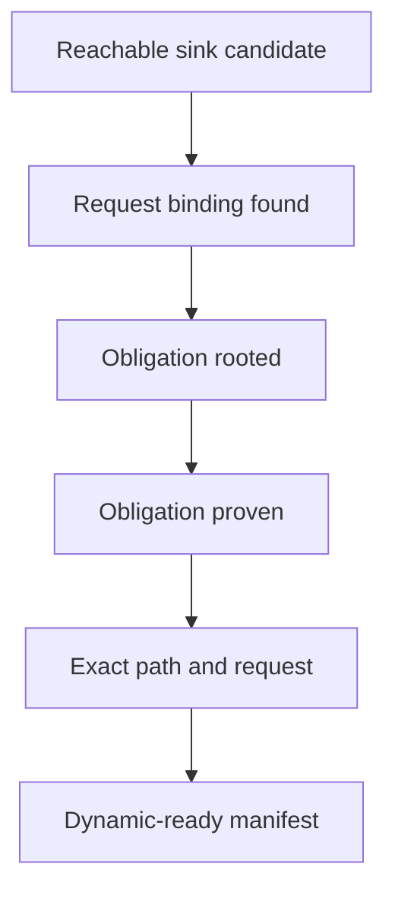
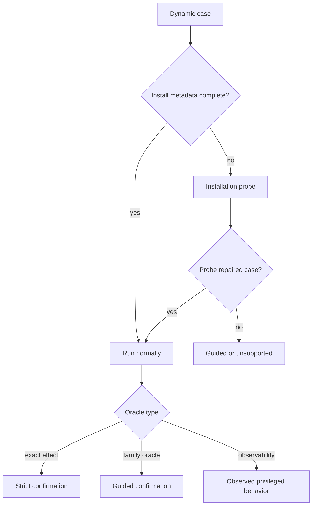

# How It Works

## TLDR

Kernel Sieve takes a Windows kernel driver `.sys` file, statically recovers the user-reachable IOCTL surface, tracks which request fields can reach dangerous kernel sinks, tries to prove that the dangerous sink arguments are actually request-controlled, then hands the strongest cases to a dynamic runner that executes them in a disposable Windows Server 2022 VM and records evidence-backed verdicts.

In short:

- Stage 1 says "is this a supported driver-shaped PE and what is its stable identity?"
- Stage 2 says "where is the WDM device-control front door and which IOCTL cases exist?"
- Stage 3 says "which request bytes flow into dangerous calls?"
- Stage 4 says "can we prove the dangerous argument really comes from the request, package a runnable manifest, and assign the right dynamic oracle?"
- Stage 5 says "does the modeled request reproduce the predicted behavior in a clean guest?"

## High-Level Overview

The pipeline is static first, dynamic second.

The static side exists to avoid wasting VM time on weak candidates. It tries to recover:

- exact IOCTL cases
- exact or approximate request layouts
- exact or approximate device paths
- exact or approximate sink-argument provenance
- a per-candidate dynamic manifest

The dynamic side does not rediscover the driver surface from scratch. It consumes the Stage 4 handoff and focuses on:

- installation and device-open viability
- request execution
- sink-specific or family-level observation
- crash attribution
- resumable per-driver results

## Scope

The current production scope is narrow on purpose:

- architecture: `x64`
- driver model: `WDM`
- guest OS: `Windows Server 2022`

This is not a general Windows driver analyzer yet.

### What WDM means here

WDM is the low-level Windows Driver Model. A WDM driver usually exposes IRP handlers directly through `DriverObject->MajorFunction[]`, including `IRP_MJ_DEVICE_CONTROL`. That direct dispatch style is exactly what Kernel Sieve models today.

KMDF is the Kernel-Mode Driver Framework. WDF is the umbrella term. KMDF wraps WDM with framework-managed objects, request objects, callbacks such as `EvtIoDeviceControl`, and extra indirection. That changes where request state lives and how control reaches the real sink.

Kernel Sieve only supports WDM right now because the current recovery logic is built around:

- direct major-function registration
- WDM IRP and `IO_STACK_LOCATION` layouts
- WDM request-buffer conventions
- direct `DeviceIoControl` style front doors

Supporting KMDF/WDF well means modeling framework callbacks, request objects, queue configuration, and framework helper APIs. That is separate work.

## End-to-End Flow

## Key Ideas Before The Stages

### Oracle

An oracle is the dynamic success test for a candidate.

It answers a narrow question such as:

- did a canary section get unmapped?
- did a canary process handle get opened?
- did the driver touch the provider-backed physical test page?
- did TCG instrumentation observe port I/O or MSR access?

Examples:

- `mm_section_unmap`
- `process_open`
- `file_write`
- `mm_map_observer`
- `io_port_trace`
- `msr_trace`

Some oracles are sink-specific. Those are stronger because they are tied to the exact behavior under test. Others are family-level or observability-only and produce weaker claims.

### Obligation

An obligation is the static proof condition for a sink.

It describes what must be true about the dangerous sink arguments for the candidate to count as meaningful. Examples:

- `section_view.base_address_control`
- `process_object.target_control`
- `object_registry.target_control`
- specialized copy obligations such as destination control, source control, or overflow

For some sinks the obligation is strong and specific. For others it is still coarse and mostly says "the primary dangerous operand is request-controlled and nonzero."

### Request binding

Request binding is the bridge from a dangerous sink argument back to the incoming IOCTL request.

The pipeline tries to answer questions like:

- does this sink argument come from `SystemBuffer + 0x10`?
- does it come from `Type3InputBuffer`?
- is it derived from `InputBufferLength` or `OutputBufferLength`?
- did the driver copy it through helper arithmetic first?

Binding is weaker than proof. It says "this request field family matters." Proof says "this request-backed value satisfies the sink obligation."

### Device path

The device path is what user mode opens with `CreateFile`, for example:

- `\\.\SomeDriver`

Kernel Sieve tries to recover it from static setup code such as:

- `IoCreateDevice` or `IoCreateDeviceSecure`
- `IoCreateSymbolicLink`
- related device-naming and setup paths

If static recovery cannot confirm one exact path, Stage 5 can try to repair that through installation probing.

## Stage 1 - PE Intake And Fingerprinting

Stage 1 turns a raw `.sys` into a stable analysis subject.

What it does:

- parses the PE headers
- checks that the image is driver-shaped and supported
- records machine type and layout metadata
- computes the SHA-256 used everywhere else in the pipeline

Why it matters:

- every later artifact is rooted in the driver hash
- resumability depends on stable per-driver identity
- unsupported images are rejected before heavier work starts

Output examples:

- image metadata
- stable driver hash
- per-driver output root

## Stage 2 - CFG, Dispatch, And IOCTL Recovery

Stage 2 recovers the control flow and entry surfaces that matter for user-reachable behavior.

For the current target that means x64 WDM dispatch recovery around `IRP_MJ_DEVICE_CONTROL`.

What it does:

- builds CFGs for relevant functions
- finds driver entry and setup patterns
- recovers `MajorFunction` assignments
- identifies device-control handlers
- extracts IOCTL constants and nearby request-shape hints

What comes out:

- handler RVAs
- front-door summaries
- device-control surfaces
- IOCTL cases
- CFG artifacts reused later by verification

Why this stage is critical:

- if dispatch recovery is wrong, the later taint and proof work is pointed at the wrong code

## Stage 3 - Taint And Request Modeling

Stage 3 asks: "which request data can reach the dangerous call?"

### How taint analysis is done

The static taint engine tracks expressions rooted in driver request state. In the current codebase this is centered on `static/src/ks_taint.c`.

It models WDM request sources such as:

- `ios.DeviceIoControl.IoControlCode`
- `ios.DeviceIoControl.InputBufferLength`
- `ios.DeviceIoControl.OutputBufferLength`
- `ios.DeviceIoControl.Type3InputBuffer`
- request-backed buffer loads from `SystemBuffer`, `Type3InputBuffer`, `UserBuffer`, and MDL-backed views as applicable

The engine:

- tracks expression trees, not just one-bit taint
- records arithmetic such as add, sub, mask, shift, extend, truncate, and phi-style merges
- ranks callsites by how much request-backed control reaches the modeled sink arguments

That gives Stage 3 two important things:

1. a candidate sink callsite
2. a request-side story for how input bytes reach it

### What request modeling means

Stage 3 also starts building the request contract:

- IOCTL value
- transfer method
- minimum size hints
- which buffer or scalar slot each sink argument seems to come from

This becomes the base for `request_model.json` and later per-candidate request manifests.

### Static proof levels

These labels describe how strong the current static story is. They are not all equally common.

| Proof level | Meaning | Example |
| --- | --- | --- |
| `local_exact` | all required sink args were locally proven from request-backed values with no precision loss | the unmap base address or a copy destination is exactly recovered from the request |
| `local_approximate` | same as `local_exact`, but some witness widened, merged, or lost exactness | the right operand is proven, but after a truncate or mixed-path merge |
| `partial_local_exact` | some required sink args were locally proven exactly, but not all | one dangerous operand of a multi-arg sink is exact, another is still open |
| `partial_local_approximate` | same as `partial_local_exact`, with precision loss | part of the sink is proven, but widened |
| `local_rooted_exact` | all required sink args are rooted in request state, but the full obligation is not yet proven | the target PID or physical address is definitely request-backed, but the full semantic check is still weaker |
| `local_rooted_approximate` | same as `local_rooted_exact`, with precision loss | request-backed, but through widened arithmetic |
| `partial_local_rooted_exact` | only some required args are rooted exactly | only one of several dangerous operands is grounded in request state |
| `partial_local_rooted_approximate` | same, with approximation | partial rootedness through a lossy expression |
| `fallback_symbolic_exact` | the local proof was incomplete, but bounded handler-to-sink symbolic fallback reached the sink and recovered exact request-backed control | local proof missed a helper path, fallback closed it |
| `fallback_symbolic_approximate` | same as above, with approximation | fallback reaches the sink but some operand recovery is widened |
| `metadata_lift_exact` | sink reachability was not closed directly, but metadata and provenance still recovered exact request-backed control of the missing operand | helper metadata repairs one missing operand without a full sink hit |
| `metadata_lift_approximate` | same, with approximation | metadata lift works, but not exactly |
| `request_binding_only` | at least one sink argument can be named as request-backed, but the sink obligation was not proven | "this field likely chooses the physical address or PID" |
| `request_binding_approximate` | same as `request_binding_only`, but the binding is lossy or provisional | request-backed story exists, but through shared-tail or widened arithmetic |
| `candidate_only` | the sink is interesting, but no useful request-backed witness survived | static triage lead only |

The buckets that matter most in practice:

- `local_exact` is strong static evidence
- `request_binding_only` is still a real dynamic lead
- `candidate_only` is usually not a good automatic execution candidate

## Stage 4 - Local Verification, Proof Grading, And Handoff

Stage 4 turns Stage 3 leads into a real static-to-dynamic contract.

### How symbolic execution is performed

Kernel Sieve uses real symbolic reasoning here, but it is not whole-driver exploration.

The first pass is a local structured proof:

- it builds a small verifier module for the candidate
- creates symbolic request-backed expressions
- resolves sink-argument bindings
- applies per-sink obligation constraints
- calls `xair_sym_check()` to ask if the structured constraints are satisfiable

The implementation uses:

- `xair_sym`
- Z3 through the vendored symbolic stack

If the local proof is incomplete, Stage 4 can try a bounded fallback slice:

- slice the handler down to the sink
- initialize a synthetic WDM state with `DEVICE_OBJECT`, `IRP`, `IO_STACK_LOCATION`, request buffers, and MDL-backed views as needed
- make request bytes symbolic and tainted as `request_input`
- explore a bounded handler-to-sink slice

This fallback is still conservative. It is not "symbolically execute the entire driver until something interesting happens."

### What Stage 4 proves

Stage 4 grades several separate properties:

- request exactness
- path exactness
- sink exclusivity
- obligation feasibility
- obligation proof
- oracle availability
- dynamic manifest completeness

The key booleans are:

- `request_layout_exact`
- `device_path_exact`
- `ioctl_case_exact`
- `path_reachable_exact`
- `sink_exclusive_to_case`
- `obligation_feasible`
- `obligation_proven`
- `dynamic_oracle_available`
- `oracle_sink_specific`
- `oracle_self_test_supported`
- `dynamic_manifest_complete`
- `dynamic_ready`

### What dynamic readiness means

`dynamic_manifest_complete` means the candidate has enough structure to serialize a runnable manifest:

- synthesized request
- oracle assigned
- `candidate_id`
- `execution_recipe_key`
- at least one device path candidate

`dynamic_ready` is stricter. It means the case is ready for automatic confirmation, not just for guided execution.

### What Stage 4 writes

The important outputs are:

- `verification.json`
- `request_model.json`
- `requests/`
- `models/`
- `pocs/`
- `dynamic_cases/`
- `snapshots/`
- `handoff.json`

What they mean:

- `verification.json`: per-driver index of verification records and proof fields
- `request_model.json`: driver-wide recovered request vocabulary and IOCTL surface
- `requests/`: per-candidate static request contract
- `models/`: serialized symbolic testcase artifacts
- `pocs/`: generated user-mode harnesses for manual reproduction
- `dynamic_cases/`: the actual static-to-dynamic contract consumed by Stage 5
- `snapshots/`: saved symbolic snapshots when fallback exploration captures useful state
- `handoff.json`: portable summary of the driver handoff package

## Stage 5 - Dynamic Confirmation

Stage 5 consumes the handoff and executes candidates in a disposable Windows guest.

The current runtime model is:

- QEMU
- KVM for the fast default path
- TCG for slower instrumented lanes
- QEMU Guest Agent for host-to-guest control

The normal run shape is:

1. baseline
2. variant
3. baseline

That helps separate the candidate effect from ambient guest noise.

### Installation status

Static installation status is the runner's first view of whether a candidate is actually runnable.

Current statuses are:

| Status | Meaning |
| --- | --- |
| `declared` | the manifest has enough install metadata to attempt normal setup |
| `probe_required` | static metadata is not trustworthy enough, so the runner should probe setup first |
| `metadata_missing` | basic installation metadata is absent |
| `package_incomplete` | the driver package is incomplete for the declared install mode |
| `mode_unknown` | the install mode is not known confidently |
| `manual_only` | current automation should not attempt installation |
| `offline_boot_install` | installation requires an offline or boot-start workflow |
| `inf_path_missing` | an INF-based install was declared but the INF path is missing |
| `dependencies_incomplete` | declared service dependencies are incomplete |

### What installation probing is

Installation probing is a narrow pre-execution step that asks:

- can this driver be staged?
- does it load?
- what service mode actually works?
- what device path can we really open?

This is different from sink execution. It is setup repair.

Why the tool does it:

- static metadata can be incomplete or wrong
- some drivers load but expose a different usable device path than the static guess
- installation issues should be separated from sink-confirmation issues

The probe writes a `driver-installation-result.json` that separates:

- support before probe
- probe-prepared support
- support after probe

### Support outcomes

After normalization and optional probing, the runner classifies cases as:

| Support status | Meaning |
| --- | --- |
| `automatic_supported` | ready for the automatic queue |
| `guided_supported` | runnable, but still missing exact oracle inputs or repaired metadata |
| `observability_only` | meaningful to run for observation, but not for a strict effect claim |
| `unsupported` | outside the current production scope |
| `harness_error` | internal runner failure, not a property of the driver |

### Examples of how different sinks are checked dynamically

| Sink family | Example dynamic check |
| --- | --- |
| section unmap | create a canary section view and verify the variant request unmapped it while controls stayed clean |
| section map | look for the predicted canary mapping effect |
| physical memory mapping | use the synthetic hardware provider and observer-backed MMIO correlation to confirm access to the provider-backed test page |
| process lookup/open/reference | create a canary process or handle target and see whether the exact requested effect occurs |
| registry create/set/delete | use canary registry paths and values |
| file create/write/delete | use canary files and inspect the resulting file-system effect |
| copy memory | use canary buffers and look for the predicted overwrite or corruption pattern |
| port I/O | use TCG instrumentation to observe `in` or `out` behavior |
| control register access | use instrumentation or marker-based observation, currently weaker than exact guest-side effects |
| MSR access | use instruction-trace based observation, currently mostly observability-oriented |

### Verdicts and evidence

Stage 5 keeps four ideas separate:

- reproduction status
- security claim
- evidence level
- confidence

Evidence levels:

- `E0`: no meaningful evidence, usually harness or path failure
- `E1`: informative but weak or non-dispositive result
- `E2`: stronger than a generic inconclusive, still short of sink-correlated confirmation
- `E3`: sink-correlated instrumentation without a strong guest-side effect
- `E4`: confirmed behavior or reproducible driver-attributed crash
- `E5`: strongest boundary-crossing claim

## Two Graphs That Matter In Practice

### Static proof funnel

### Dynamic decision path

## Current Issues And Known Gaps

This is the current state of the implementation, not a wish list.

1. Scope is intentionally narrow.
   - only `x64 WDM`
   - only Windows Server 2022 guest images
   - no KMDF/WDF modeling yet

2. Several sink families still have coarse Stage 4 obligations.
   - the strongest local proof models today are still better for `section_view_unmap` and `copy_memory`
   - physical mapping, privileged register access, many process sinks, and many registry/file sinks still rely more on the dynamic oracle than on a rich local semantic model

3. Some dynamic families are still observability-first.
   - physical-memory mapping
   - port I/O
   - control-register access
   - MSR access

4. Guided cases still depend heavily on good installation metadata and request models.
   - a candidate can be real and still fail automatic execution because the manifest is incomplete

5. Host environment matters.
   - the fast dynamic lanes need KVM
   - a host without `/dev/kvm` cannot run the KVM-backed path correctly
   - TCG exists, but it is much slower

6. Some sink classes remain weakly automated.
   - `file_open`
   - `sanitizer_or_buffer_map`
   - `irp_completion`

7. Live counts and timings should be read from run artifacts, not copied into this note.
   - `driver_timings.jsonl`
   - `verification.json`
   - `queue-funnel-report.json`
   - `driver-result.json`
   - `queue-run-summary.json`

## Future Plans

The obvious next steps are:

1. Stronger semantic obligations for the coarse sink families.
   - especially physical-memory mapping, process-object sinks, and privileged-register sinks

2. Better exact-effect oracles.
   - more sink-specific guest-visible effects
   - less reliance on observability-only evidence where possible

3. Better guided-to-automatic promotion.
   - repair more incomplete manifests automatically at probe time

4. KMDF/WDF support.
   - framework callback recovery
   - WDF request-object modeling
   - framework-aware request binding

5. Broader environment support.
   - more guest OS versions
   - more installation workflows
   - eventually more architectures

6. Clearer end-impact proofs on the dynamic side.
   - stronger boundary-crossing evidence for families that are currently confirmed only as privileged behavior

## What To Read Next

If you want the code-level details behind this note, start here:

- `docs/architecture.md`
- `docs/stage-1-pe-intake.md`
- `docs/stage-2-cfg-dispatch-ioctl.md`
- `docs/stage-3-provenance-and-modeling.md`
- `docs/stage-4-local-verification-and-handoff.md`
- `docs/stage-5-dynamic-confirmation.md`
- `docs/sink-matrix.md`
